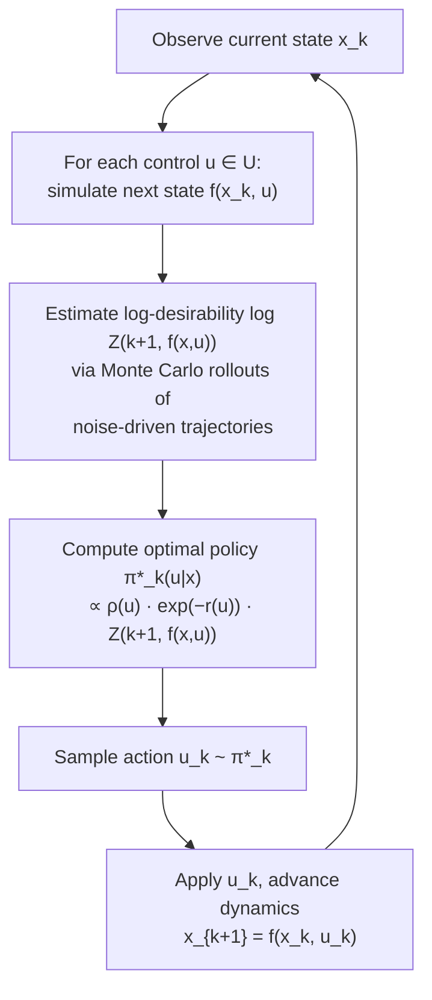

# Active Inference Exploration

KL control (path-integral control) applied to nonlinear dynamical systems.
This repository implements the KL-divergence-based stochastic optimal control
framework from the foundational work of Todorov (2006) and Kappen (2005),
following the reformulation and analysis in the reference paper
(`References/KL_control.pdf`).

The main demonstration is a **cart-pole pendulum** swing-up and balance task
solved entirely via Monte Carlo estimation of the desirability function —
no gradient computation, no value-function approximation, and no model
linearization.

## Algorithm Overview



## Mathematical Framework

KL control reformulates stochastic optimal control by replacing the
hard constraint on control cost with a KL-divergence penalty between
the controlled and uncontrolled (noise-driven) dynamics.

**Objective** (Problem 3.1 in the reference paper):

```
min_π  E[ Σ_{k=0}^{N} ℓ_k(x_k) + Σ_{k=0}^{N-1} KL(π_k || ρ_w_k) ]
```

where `ℓ_k(x_k)` is the state cost and `KL(π_k || ρ_w_k)` penalizes
deviation of the control policy `π_k` from the noise prior `ρ_w`.

**Key result** (Theorem 4.1): the optimal policy has a closed-form solution

```
π*_k(u | x)  =  ρ_w(u) · Z(k+1, f(x,u))  /  A[Z](k, x)
```

where the **desirability function** `Z(k,x)` satisfies

```
Z(k,x)  =  E[ exp( −Σ_{s=k}^{N} ℓ_s(x̄_s) ) | x̄_k = x ]
```

and `x̄` evolves under pure noise (`x̄_{k+1} = f(x̄_k, w_k)`).
Because `Z` is an expectation, it can be estimated via Monte Carlo
sampling of noise-driven trajectories — this is the **path-integral**
representation (Corollary 4.2).

## Cart-Pole Setup (Section 6.2)

| Parameter | Symbol | Value |
|---|---|---|
| Cart mass | M | 1.0 kg |
| Pendulum mass | m | 0.1 kg |
| Rod length | L | 1.0 m |
| Timestep | τ | 0.05 s |
| Horizon | N | 40 steps |
| Discrete inputs | U | {−20, −18, …, 18, 20} N |
| Noise std dev | σ | 5.0 N |

State vector: `x = [x̄, x̄̇, θ, θ̇]` — cart position, cart velocity,
pole angle from vertical, pole angular velocity.

Stage cost: `ℓ(x) = q₁|x̄| + q₂|x̄̇| + q₃|θ| + q₄|θ̇|`

## Running

```bash
# Create and activate a virtual environment
python -m venv .venv
source .venv/bin/activate
pip install numpy matplotlib tqdm

# Run the cart-pole simulation (150 steps, uses all CPU cores)
python exploration/KLcontrol_nonLinearSystem.py
```

The simulation first runs the KL control loop (with a progress bar),
then shows an animated cart-pole visualization, and finally displays
a diagnostic metrics figure (also saved to `exploration/metrics.png`).

### Diagnostic Metrics

After the simulation, five diagnostic plots are generated:

1. **Cumulative stage cost** — should flatten as the controller stabilizes
2. **Policy entropy** — decreases as the policy becomes more confident near equilibrium
3. **KL divergence from noise prior** — quantifies control effort; drops as less active control is needed
4. **State norm** — ||x||₂ should converge toward 0
5. **Log-desirability** — increases as the state improves

## References

- Todorov, E. (2006). *Linearly-solvable Markov decision problems.* Advances in Neural Information Processing Systems.
- Kappen, H.J. (2005). *Path integrals and symmetry breaking for optimal control theory.* Journal of Statistical Mechanics.
- Reference paper in `References/KL_control.pdf` — reformulation and general analysis of KL control for continuous spaces, including the cart-pole example in Section 6.2.
