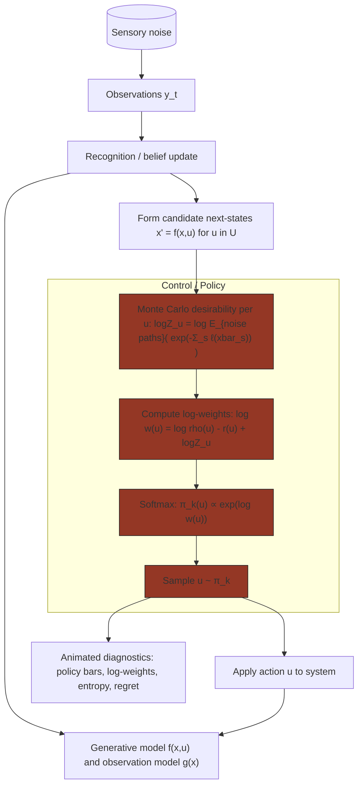

# KLcontrol_nonLinearSystem — Algorithm Overview

## Overview
This file accompanies [exploration/KLcontrol_nonLinearSystem.py](exploration/KLcontrol_nonLinearSystem.py) and documents the KL-control active inference algorithm used to control nonlinear dynamical systems. It gives a concise conceptual description and a detailed Mermaid flowchart showing data flow and computations.

## Conceptual description (concise)
- The algorithm alternates between (1) predicting sensory consequences from current beliefs using a generative model, (2) comparing predictions with actual observations to update beliefs (state estimation), and (3) selecting actions that minimise the KL divergence between predicted sensory states and a preferred (target) distribution over future states. In this implementation actions are chosen by evaluating a discrete stochastic policy: Monte Carlo estimates of a desirability function (Z) are computed for each candidate control, a softmax (weighted by control cost and noise prior) forms the policy, and an action is sampled. There is no continuous gradient descent over actions here.

## Detailed dataflow (Mermaid)
Below is a detailed flowchart showing the major components and computational steps used by the code. Copy this block into a Markdown renderer that supports Mermaid to view the diagram.



## What this file does
- Implements an active-inference / KL-control controller for a nonlinear system. It contains: model definitions (nonlinear dynamics and observation model), a state-estimation routine (recognition model), and a control loop that optimises actions to minimise a KL-based objective over a planning horizon.

### Key equations used (implementation)

- Policy (implemented):

  $\pi^*_k(u; x) \propto \rho(u) \; e^{-r(u)} \; Z\big(k+1, f(x,u)\big)$

  where $Z(k,x)$ is the desirability function estimated by Monte Carlo.

- Desirability (Monte Carlo estimator, implemented as log-sum-exp):

  $\log Z(k,x) = \log \mathbb{E}_{\text{noise paths}}\Big[\exp\big(-\sum_{s=k}^N \ell(x_s)\big)\Big]$

  (computed by simulating many noise-driven trajectories from $x$ and using the log-sum-exp trick for numerical stability)

## How to run
- Ensure Python 3.8+ and typical scientific packages are installed (numpy, scipy, matplotlib). If you use a virtual environment, activate it first.

- From the repository root run:

```bash
python exploration/KLcontrol_nonLinearSystem.py
```

- Expected behaviour: the script runs a simulation loop, prints progress to console, and opens or saves diagnostic plots showing states, actions, prediction errors and objective evolution. See the script header for additional runtime options or switches.

## Dependencies
- numpy
- scipy
- matplotlib
- (optional) autograd, jax, or numdifftools if numeric gradients are used

## Outputs
- Time-series plots of true vs estimated states, applied controls, and objective (KL/free energy) over time. Optionally saved figure files or arrays depending on script flags.

## Evaluation metrics added (and plotted)
The script now collects and plots a set of diagnostics that help verify the implementation matches the theory.

- **Policy entropy:** H(π_k) = -Σ π log π. Shows how concentrated the computed optimal policy is (low entropy ⇒ policy is confident/exploitative; high entropy ⇒ exploratory). A correctly computed π* will typically concentrate as the horizon shortens or when one action yields much higher desirability.

- **Regret (log-weight gap):** For the sampled action at each step we compute regret = max_u log w(u) − log w(u_chosen), where log w(u) is the unnormalized log-weight (log ρ(u) − r(u) + log Z). Low regret indicates the sampled action is close to the best according to the objective; consistently low regret supports that sampling follows the computed desirability ordering.

- **Chosen-action rank:** The rank (1 = best) of the sampled action when candidates are sorted by log-weight. If the implementation is correct, sampled actions should often have low ranks (near 1), showing the policy is selecting high-desirability controls.

- **Expected immediate stage cost vs realized cumulative cost:** At each step we compute the expected stage cost under the computed policy (Σ_u π(u|x) ℓ(f(x,u))) and the cumulative realized cost along the rollout. Lower expected and realized costs compared to naive baselines indicate the policy is minimising the expected objective as intended.

These diagnostics are shown interactively as animated panels alongside the cart-pole animation (policy bar, log-weights, and live metrics). They provide direct empirical checks that: the policy is well-formed (entropy), actions are biased toward high-desirability candidates (rank/regret), and the policy reduces expected/realized cost. A static diagnostics plot is no longer produced by default.

## Additional (optional) metrics to strengthen a theoretical claim
The following are recommended if you want stronger empirical evidence of convergence to the theoretical optimum; they are not automatically run by default because they require many extra rollouts or expensive Monte Carlo sweeps:

- **Empirical action-frequency KL:** Run many independent rollouts, collect empirical action frequencies at each time step, and compute KL(empirical || π*). Small KL across states/time supports that sampling matches the computed π*.
- **Convergence of Monte Carlo desirability:** For a fixed state, evaluate `log Z` with increasing `num_samples_per_control` and plot convergence (with repeats for CI). This shows Monte Carlo stability and helps explain any suboptimality.
- **Expected cumulative cost under policy vs baselines:** Run many rollouts under the learned policy and under baselines (random, greedy best-Z) and compare mean total cost with confidence intervals. Theoretical optimality implies the KL-control policy should have lower expected cost than naive baselines when model assumptions hold.
- **State distribution vs target / KL-to-target:** For tasks with an explicit target distribution over states, compute divergence (KL or Wasserstein) between empirical state distribution under the policy and the target. Decreasing divergence indicates the controller succeeds in steering the system toward preferred states.

If you want, I can add the optional multi-rollout evaluation and the Monte Carlo convergence plots as an extra script or as flags to the current script.

## References
- The algorithm is based on KL-control / active inference principles. See references/KL_control.pdf for full derivation and notation.

---
File: exploration/KLcontrol_nonLinearSystem.py
